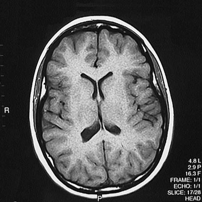
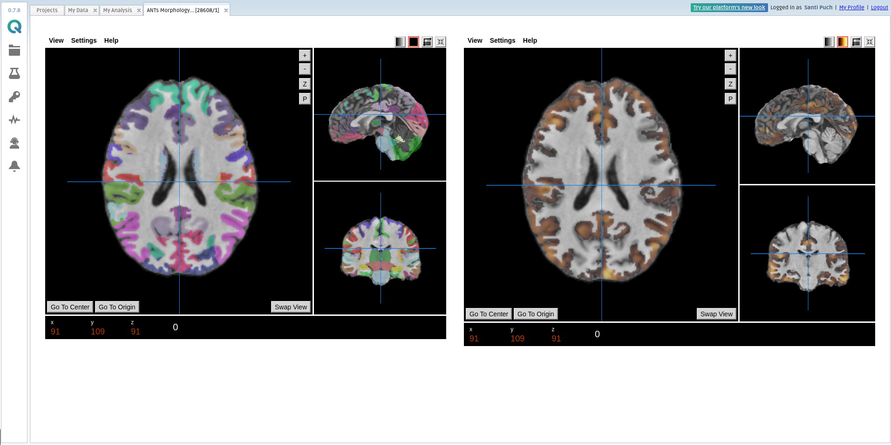

# QMENTA 1000 Brains Challenge 2018


----------------

## Goal

In the 1000 Brains Challenge, participants are asked to **predict the age** of healthy individuals based on **structural Magnetic Resonance images** of their **brains**.

## Participation

#### NOTE: This challenge is no longer open

The 1000 Brains Challenge was presented for the first time in the context of the **Hackathon Nacional de Salud 2018**, the **15th and 16th June** in the **Centro Nacional de Investigaciones Cardiovasculares (CNIC), Madrid.** 

<div style="width: 100%; overflow: hidden;">
  <div style="float: left; width: 15%; padding: 20px">
    
  </div>
  <div style="float: left; width: 15%;">
    
  </div>
</div>

It was later re-opened for the **[VISUM Summer School 2018](http://visum.inesctec.pt/)**, which took place in Porto from 5th July to 13th July. 

<div style="width: 100%; overflow: hidden;">
  <div style="float: left; width: 45%; padding: 20px">
    
  </div>
  <div style="float: left; width: 45%;">
    
  </div>
</div>

## Evaluation

A submission is considered eligible for evaluation if the following conditions are met:

- A CSV with the predicted ages for the **test** set is produced, named *SubmissionID_age_predictions.csv*, where *SubmissionID* is a unique identifier of your submission. For example, the *SubmissionID* can be your full name if you submit your work by yourself, or the name of the institution you are working in. The produced CSV should have the following structure:

SubjectID | Predicted Age
--------- | -------------
28751 | 95
29003 | 12
(...) | (...)
33828 | 57

- An SDK tool is produced and deployed to the QMENTA platform, following the guidelines and recommendations shown in this repository.

- The tool is shown to run and finish succesfully in the QMENTA platform, giving a prediction of the age for at least 2 test subjects.


Submissions will be scored according to the [Mean Squared Error](http://scikit-learn.org/stable/modules/model_evaluation.html#mean-squared-error) (MSE) of the predictions of the test data.

_NOTE: The baseline MSE score obtained with the Linear Regression example demonstrated in this repository is **144.088**_.

## Resources

- **Database**: 1000 healthy individuals with T1-weighted Magnetic Resonance images and their associated age in years. Be aware that this database is currently available for personal research only. It is strictly prohibited to sell, redistribute or use the data for commercial purposes.



- **Volumetric and Morphometric analyses**: all the T1-weighted images have been processed with a standard volumetric and morphometric analysis tool available in the QMENTA platform.



- **Getting started material**: this GitHub repository contains introductory Jupyter notebooks to train a simple regression model and package your predictive model in a Docker image with the QMENTA SDK.


## Preparing the Python environment

_NOTE_: _The Jupyter notebooks in this repository have been written and tested with **Python 2.7**._

At QMENTA we use Conda extensively for managing Python packages and environments. It is especially useful because it allows having different environments with different Python versions without needing to change to another environment management system. 

After [installing Miniconda for your platform](https://conda.io/docs/user-guide/install/index.html) (Windows, macOS or Linux), you can create a replica of the environment used to create these notebooks by executing the following commands:
```s
conda env create -f environment.yml
```

When the environment creation process finishes you can activate your environment in order to run Jupyter Lab and inspect the provided code:
```s
conda activate qmenta_1000_brains
jupyter lab
```

## Contents of the repository

File | Description
---- | -------------
train_simple_regression_model.ipynb | Example Scikit-Learn regression model trained on the 1000 brains volumetric data.
create_tool_qmenta_sdk.ipynb | Create a model artifact to use for inference, create a tool with the QMENTA SDK and package it in a Docker container image. 
Dockerfile | Set of instructions interpreted by the Docker Engine that specify how the Docker image is built.
environment.yml | Conda environment file
predict_age.py | Python script that implements the age prediction tool using the QMENTA SDK
predict_age_settings.json | Settings specification in JSON format that has to be introduced when registering the tool in the QMENTA platform
